# 《人工智能基础A》大作业

**Pycharm可视化开发综合应用实践**

## 实验目的

通过实验，学会Pycharm可视化开发。具体目标要求如下：

- 学习PyQt5图形界面开发
- 掌握Qt Designer与pyuic工具
- 综合运用PyQt5和深度学习技术，开发一个人脸情感图像识别模型。

## 实验内容及要求

实验步骤（仔细阅读，按照步骤完成实验）

### pycharm下配置pyqt5

#### macOS环境下PyCharm中pyqt5配置流程

##### 创建conda虚拟环境

```bash
conda create -n env_name python=3.12
```

##### 安装PyQt5

```bash
pip install -i https://pypi.tuna.tsinghua.edu.cn/simple/pyqt5

pip install -i https://pypi.tuna.tsinghua.edu.cn/simple/pyqt5-tools
```

##### 在pycharm中配置外部工具

打开pycharm并选择第一步创建的conda虚拟环境"env_name"为默认python解释器，然后打开设置进入外部工具配置页面，点击"+"添加工具。

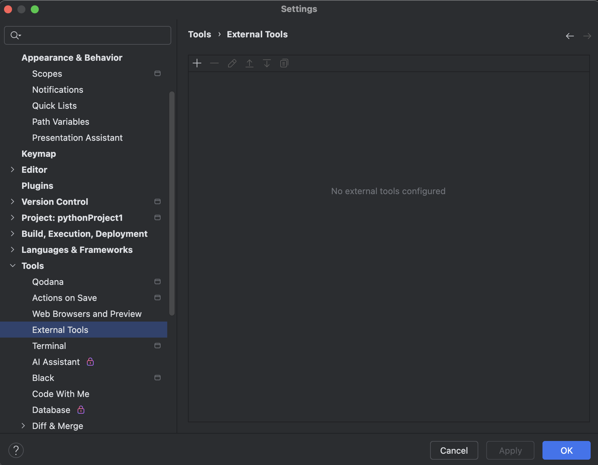

注意：接下来的配置会使用选中python解释器的安装路径

- 配置QtDesigner工具（用于编写.ui文件）
  新建QtDesigner工具，配置下图红框中的内容

```bash
Program :
/....../myenv/lib/python3.12/site-packages/qt@5/5.15.15_2/libexec/Designer.app

Working directory: $FileDir$
```

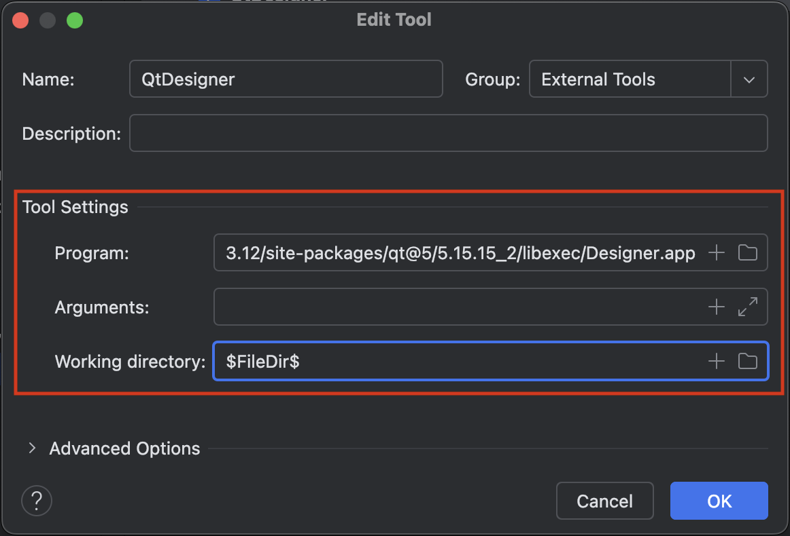

- 配置pyuic5工具（用于将.ui文件转换为.py文件）
  新建pyuic5工具，配置下图红框中的内容

```bash
Program : /....../bin/python3.12 # 当前Python目录，请根据实际修改

Arguments: -m PyQt5.uic.pyuic $FileName$ -o
$FileNameWithoutExtension$.py

Working directory: $FileDir$
```

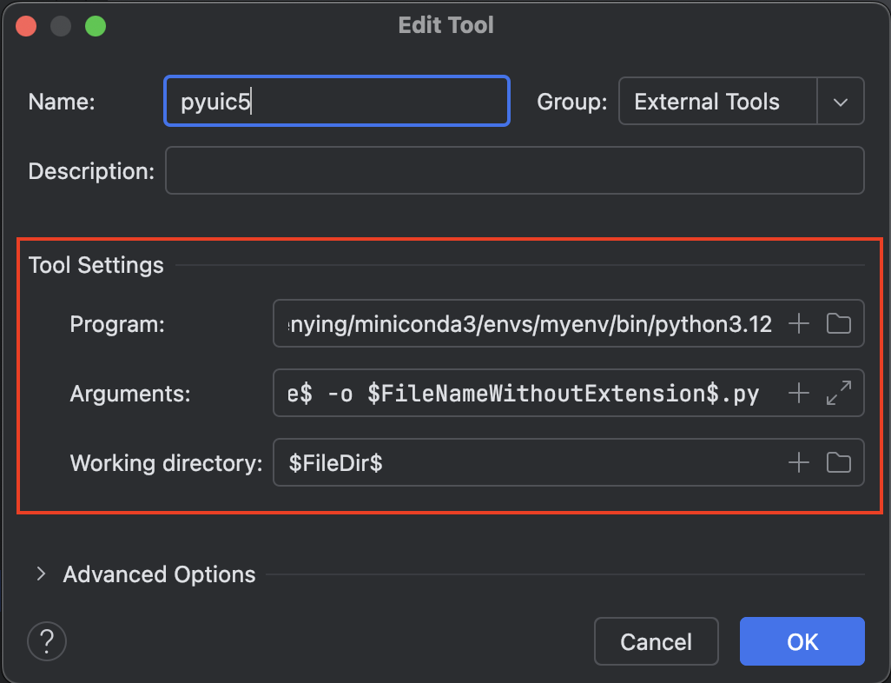

- 配置pyrcc5工具（用于将.qrc文件转换为.py文件）
  新建pyrcc5工具，配置下图红框中的内容

```bash
Program: $PyInterpreterDirectory$/pyrcc5
#当前rcc工具目录，请根据实际修改

Arguments: $FileName$ -o $FileNameWithoutExtension$.py

Working directory: $FileDir$
```

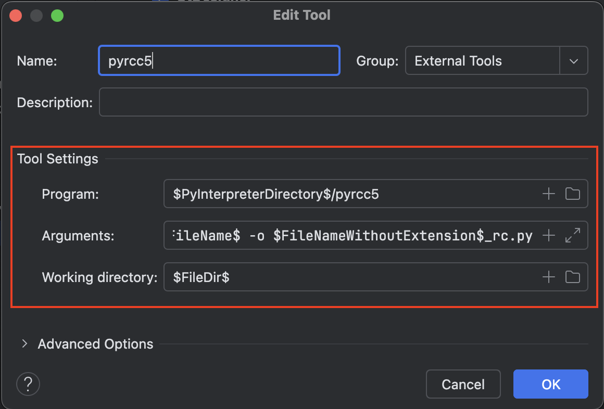

##### 使用方法

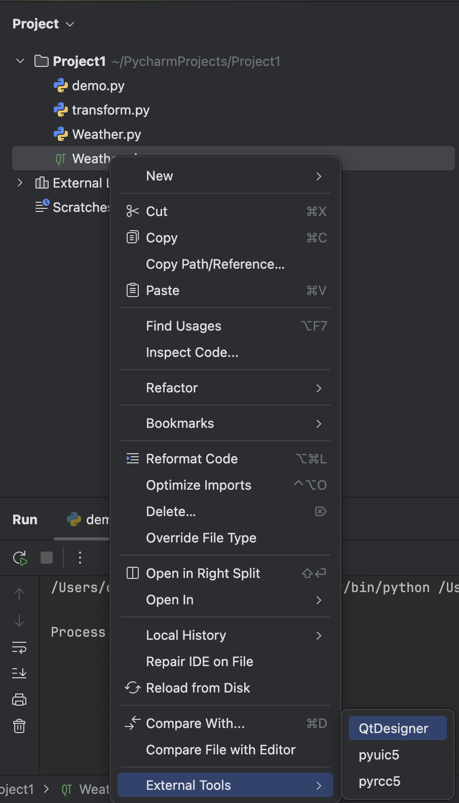

在对应的文件上右键-External Tools-QtDesigner

#### windows环境下PyCharm中pyqt5配置流程

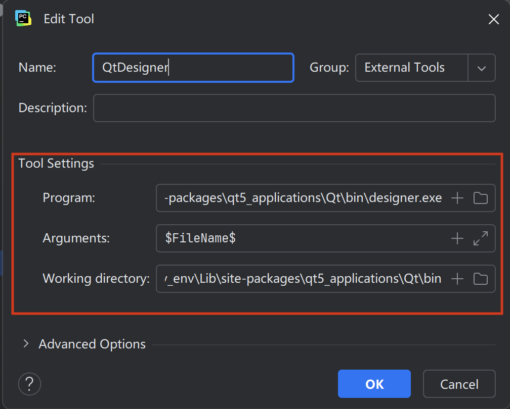

大致流程与上述相同，需要注意在外部工具配置时有所不同

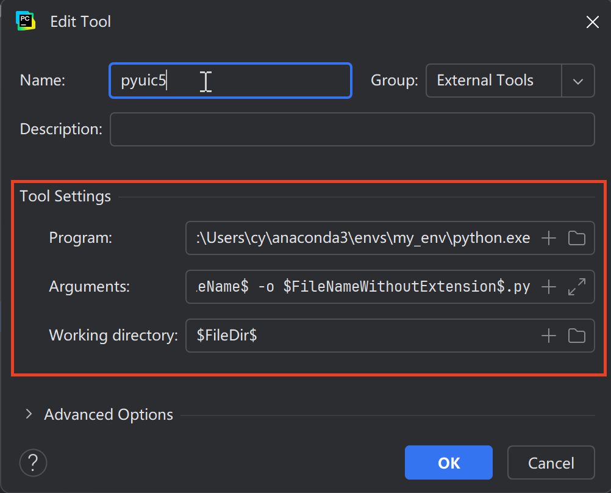

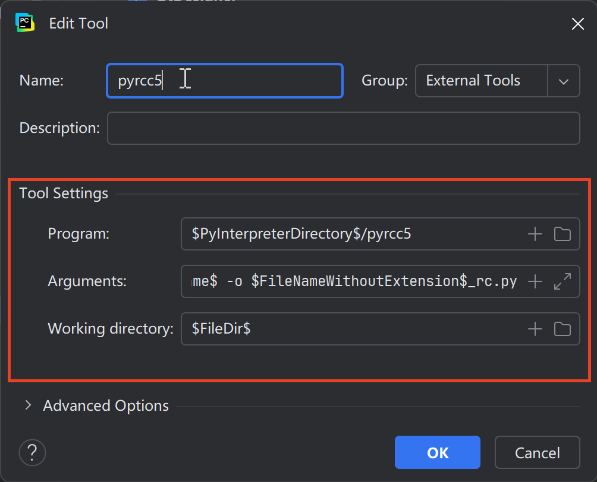

### PyQt5使用示例

#### 创建一个空白的界面

```Python
import sys
from PyQt5.QtWidgets import QApplication, QMainWindow, QLabel

app = QApplication(sys.argv)
win = QMainWindow()
win.setGeometry(400, 400, 400, 300)
win.setWindowTitle("Pyqt5 Tutorial")
win.show()
sys.exit(app.exec_())
```

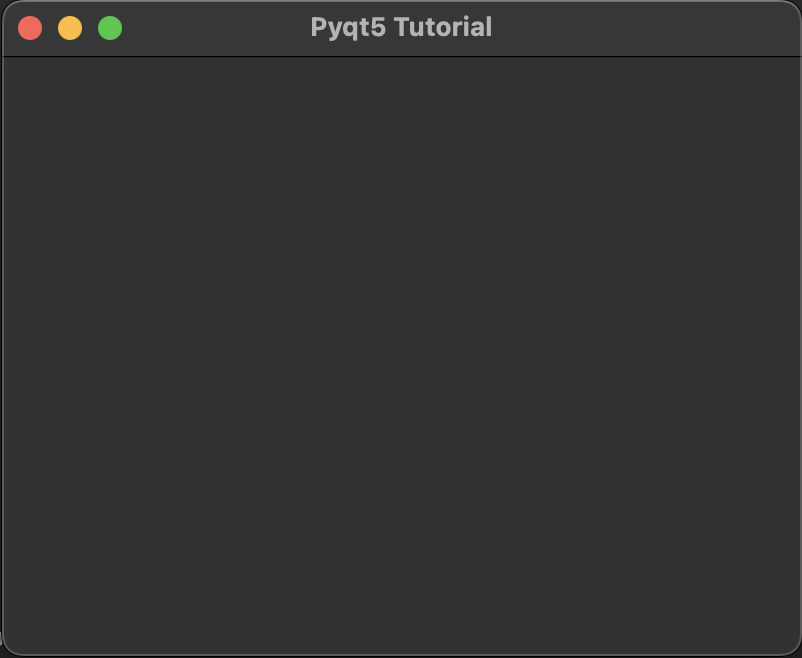

其中：

- `Qapplication()`：每个GUI都必须包含一个，Qapplication，argv表示获取命令行参数，如果不用获取，则可以使用[]代替。
- `QMainWindow()`：类似一个容器（窗口）用来包含按钮、文本、输入框等widgets。arg标识可以获取命令行执行时的参数。
- `show()`：用来显示窗口。
- `exit(app.exec_())`：设置窗口一直运行指导使用关闭按钮进行关闭。

#### 使用Pyqt5设置文本内容，我们使用Qlabel

```Python
import sys
from PyQt5.QtWidgets import QApplication, QMainWindow, QLabel

app = QApplication(sys.argv)
win = QMainWindow()
win.setGeometry(400, 400, 400, 300)
win.setWindowTitle("Pyqt5 Tutorial")
# Label Text
label = QLabel(win)
label.resize(200, 100)
label.setText("Hi this is Pyqt5")
label.move(100, 100)
win.show()
sys.exit(app.exec_())
```

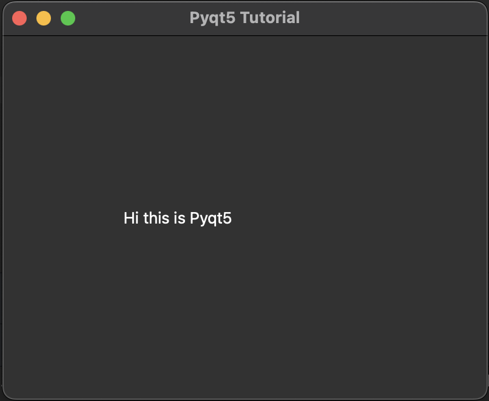

#### 按钮与事件

```Python
import sys
from PyQt5.QtWidgets import QApplication, QMainWindow, QPushButton

def click():
    print("Hy Button is clicked!")

app = QApplication(sys.argv)
win = QMainWindow()
win.setGeometry(400, 400, 400, 300)
win.setWindowTitle("Pyqt5 Tutorial")
# Button
button = QPushButton(win)
button.resize(200, 100)
button.setText("Hi! Click Me")
button.move(100, 100)
button.clicked.connect(click)
win.show()
sys.exit(app.exec_())
```

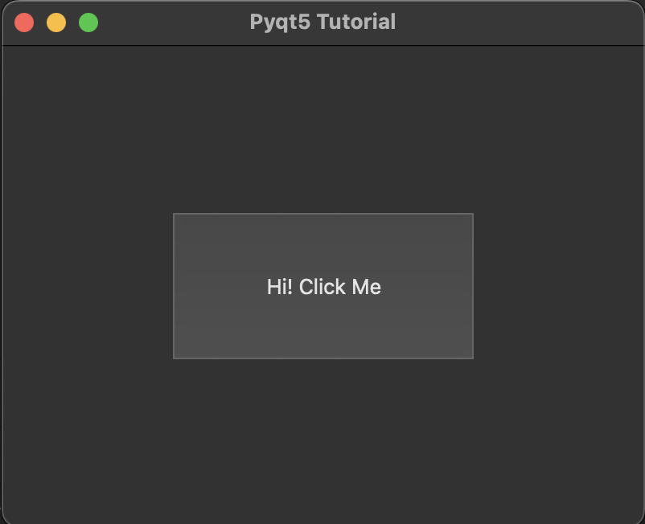

#### 使用QtDesigner设计一个界面

打开QtDesigner，新建一个窗体。

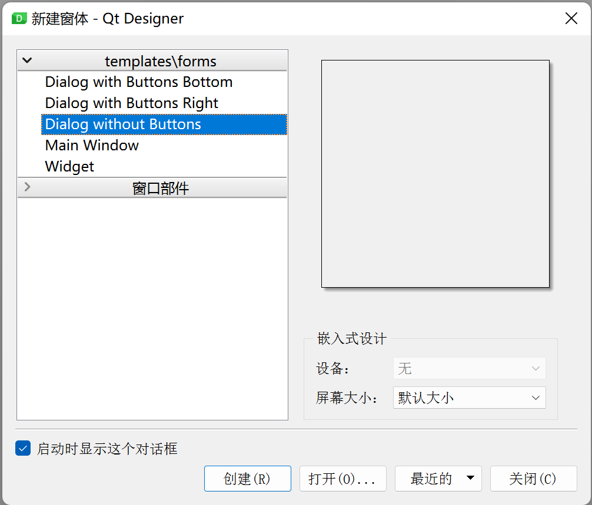

在左侧widget box中拖动所需控件到窗体中，用到的控件有Button, GroupBox,
Label,ComboBox,TextEdit，同时定义两个按钮queryBtn及clearBtn，分别用来查询及清空天气数据。

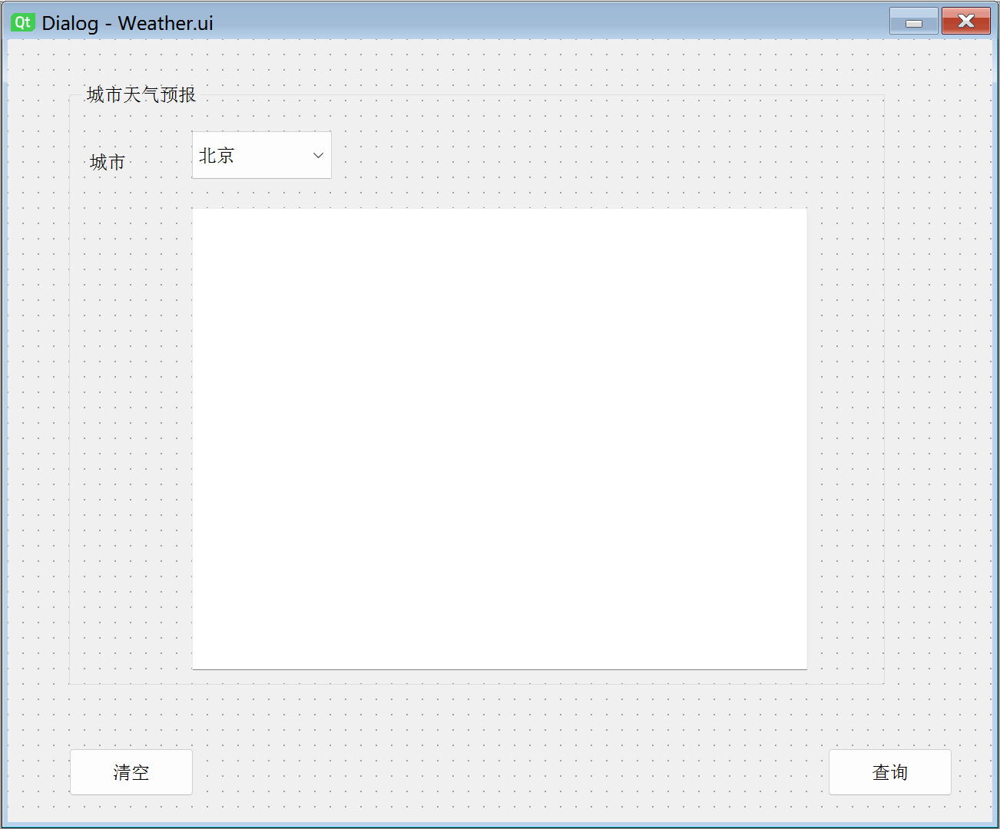

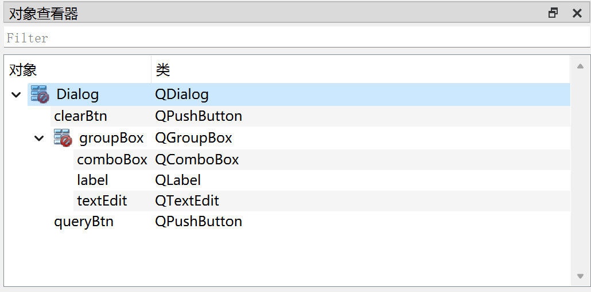

在右下角选择"信号/槽编辑器"，点击+号新增，分别选择 `queryBtn`及 `clearBtn`，选择信号 `clicked()`,
接收者 `Dialog`及槽 `accept()`，槽函数后期在代码里会进行修改。

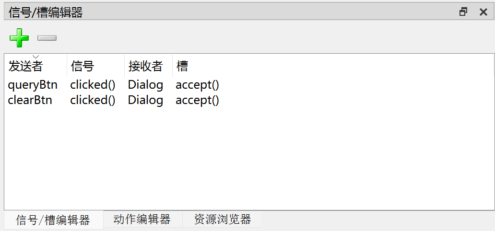

完成后保存为 `Weather.ui`文件。

#### 转换.ui文件为.py文件

为了更好的自定义及修改上面的槽函数，可以使用 `External Tools --PyUIC`，即可生成Weather.py，实际运行命令如下：

```bash
Path/to/python.exe -m PyQt5.uic.pyuic Weather.ui -o Weather.py
```

也可以右键单击Weather.ui，在External Tools中点击pyuic5

转换为.py文件后，我们需要修改两个按钮绑定的槽函数

```python
self.queryBtn.clicked.connect(Dialog.accept)
self.clearBtn.clicked.connect(Dialog.accept)
```

```Python
self.queryBtn.clicked.connect(Dialog.queryWeather)
self.clearBtn.clicked.connect(Dialog.clearText)
```

#### 调用MainDialog

新增 `demo.py`文件，在 `MainDialog`类中定义了两个槽函数 `queryWeather()`和 `clearText()`,以便在界面文件Weather.ui中定义的两个按钮(`queryBtn`和 `clearBtn`) 触发 `clicked`信号与这两个槽函数进行绑定。

```Python
import sys
import Weather
from PyQt5.QtWidgets import QApplication, QDialog, QLabel
import requests

class MainDialog(QDialog):
    def __init__(self, parent=None):
        super(QDialog, self).__init__(parent)
        self.ui = Weather.Ui_Dialog()
        self.ui.setupUi(self)


    def queryWeather(self):
        cityName = self.ui.comboBox.currentText()
        cityCode = self.getCode(cityName)
        r = requests.get(
            "https://restapi.amap.com/v3/weather/weatherInfo?key=def944d538b9cf8ad1ee992fcf6cb7e1&city={}".format(
                cityCode)
        )
        if r.status_code == 200:
            data = r.json()['lives'][0]
            weatherMsg = '城市：{}\n天气：{}\n温度：{}\n风向：{}\n风力：{}\n湿度：{}\n发布时间：{}\n'.format(
                data['city'],
                data['weather'],
                data['temperature'],
                data['winddirection'],
                data['windpower'],
                data['humidity'],
                data['reporttime'],
            )
        else:
            weatherMsg = '天气查询失败，请稍后再试！'
        self.ui.textEdit.setText(weatherMsg)

    def getCode(self, cityName):
        cityDict = {"北京": "110000",
                    "苏州": "320500",
                    "上海": "310000"}
        return cityDict.get(cityName, '101010100')

    def clearText(self):
        self.ui.textEdit.clear()

if __name__ == '__main__':
    myapp = QApplication(sys.argv)
    myDlg = MainDialog()
    myDlg.show()
    sys.exit(myapp.exec_())
```

运行demo.py并执行查询后的效果：

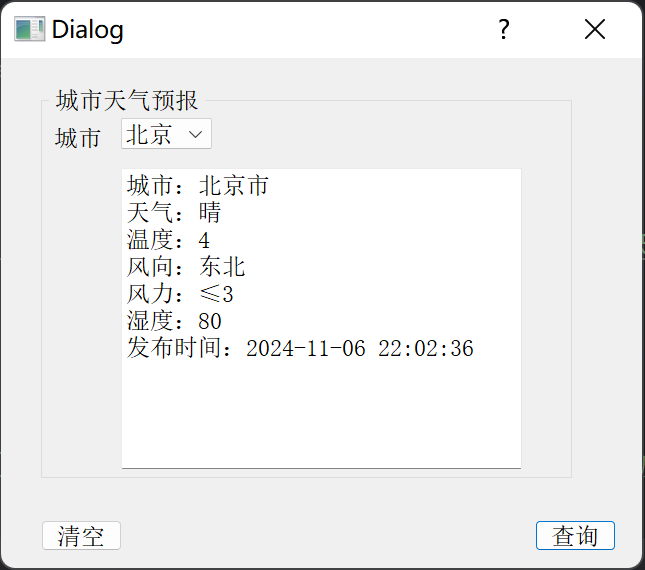

#### 将代码打包成exe文件

将.py文件打包成可执行的exe在Python中称为freezing，常用的工具有：PyInstaller,py2exe, cx_Freeze,bbfreze,[py2app](https://zhida.zhihu.com/search?content_id=237336581&content_type=Article&match_order=1&q=py2app&zhida_source=entity)等。

我们选用PyInstaller

```bash
pip install pyinstaller

pyinstaller your_script.py
```

目录结构：

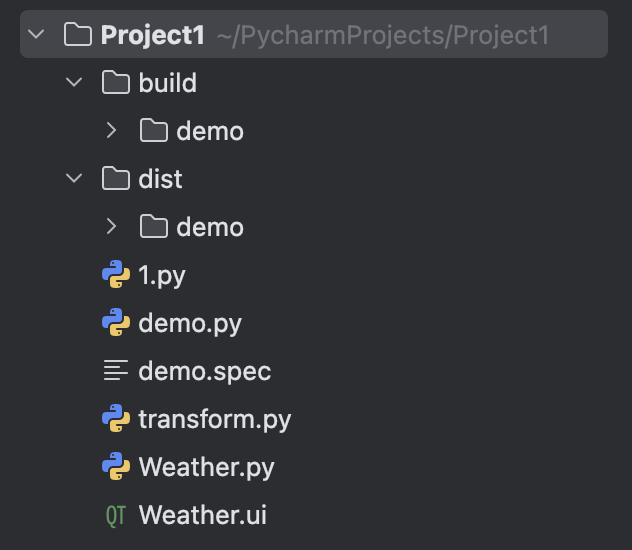

### 综合应用实践

前面我们已经用了PyTorch、tensorflow、scikit-learn等框架进行了深度学习（DL）建模，介绍了一个DL模型从数据处理、模型设计、参数设置、模型训练、模型评估的基本过程，本章将通过一个具体的实战案例来讲述如何开发一个人脸情感图像识别模型。

#### 需求分析

用fer2013人脸表情数据集，训练一个人脸情感识别模型。fer2013由加州大学洛杉矶分校（UCLA）的研究人员和国际人脸识别比赛（FERET）提供，共包含35,887张人脸图像，分为训练集（28,709张）、验证集（3,589张）和测试集（3,589张），图像分辨率48×48，灰度图像。共七种表情：生气（Anger）、厌恶（Disgust）、害怕（Fear）、快乐（Happy）、悲伤（Sad）、惊讶（Surprise）、中性（Neutral）。

软件需完成如下基本功能：

- UI界面：开发一个简单的UI界面，完成用户的一些基本操作
- 模型选择：可采用MLP或CNN二种深度学习模型中的一种进行模型的设计
- 框架选择：可采用Pytorch、Tensorflow、scikit-learn、PaddlePaddle中的任何一种
- 参数设计：超参数的设置、优化器选择、激活函数选择
- 模型训练：从头开始训练和继续训练二种模式。训练过程中可暂停/继续、中止，并显示进度和评价指标
- 模型保存：多种保存方式，如断点保存，误差最小保存，暂停时保存
- 模型测试：输入一张人脸图像，进行表情识别。

#### 系统设计

##### UI界面采用PyQT进行设计

根据以上功能要求，设计一种如下的界面供参考

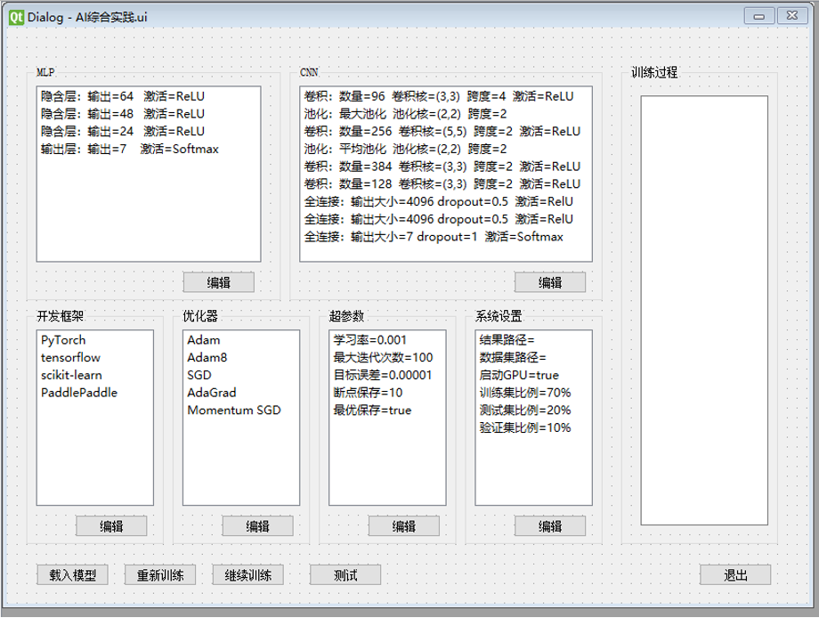

##### AI模型训练模板

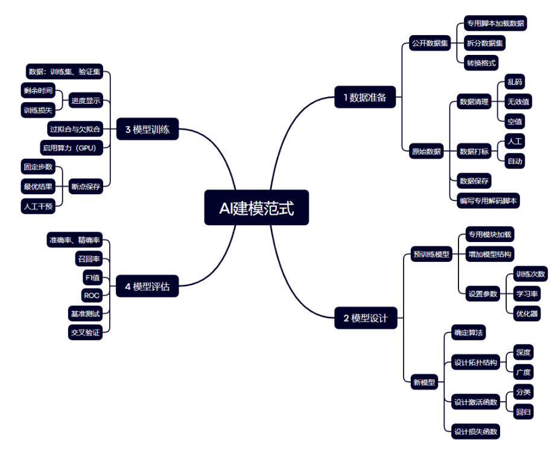

现在把模型的训练形象的比喻成炼丹，炼丹需要药材（数据）、配方（算法）和丹炉及火力（算力），虽然不能保证每次炼丹的成功与否，但都有一个标准的范式可以参考，如下图所示：

##### 评价指标

对于一个模型的预测结果，有以下这些可能：

- TP：真正例，预测为正，实际为正的例数
- FP：假正例，预测为正，实际为负的例数
- TN：真反例，预测为负，实际为负的例数
- FN：假反例，预测为负，实际为正的例数
- 准确率（Accuracy）：模型预测正确的样本数与总样本数的比值。但准确率并不适用于所有情况，特别是在样本类别不平衡时。
- 精确率（Precision）：被正确预测为正例的样本数与所有预测为正例的样本数的比值。它适用于重视准确预测正例的情况，例如疾病预测等。


- 召回率（Recall）：被正确预测为正例的样本数与所有正例样本数的比值。它适用于重视将所有正例样本预测出来的情况，如目标检测。
- F1值（F1-Score）：F1值是精确率和召回率的调和平均，特别是在它们之间存在冲突时。通常用于衡量分类模型的整体性能。F1值越高，表示模型在准确率和召回率之间取得了平衡。


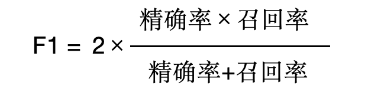

- ROC：受试者工作特征曲线（Receiver Operating Characteristic Curve，ROC），是真正率（TPR）和假正率（FPR）的关系图。曲线的面积（AUC-PR）越大，表示模型的性能越好。

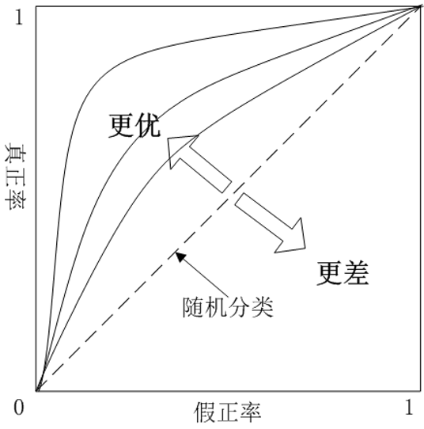

ROC曲线的绘制方法：设定一个概率阈值$p_t$，当分类器预测概率$p_{out}>p_t$时，可以得到一个预测结果，并计算出一组TPR-FPR（一个点），改变$p_t$

可以得到一系列的TPR-FPR，这些点连成线就是ROC曲线。

- 交叉验证：这是一种常用的模型评估方法，通过将数据集划分为多个子集，将模型训练和测试分别在不同的子集上进行，从而减少过拟合和提高模型性能。
- 基准测试：是一种系统性地评估模型性能的方法，旨在验证模型在不同条件下的准确性、效率、稳定性和可靠性。基准测试应选择具有代表性并被广泛认可的数据集，以确保测试结果的公正性和可比性，评价指标为上述的准确率、精确率、召回率、F1值等。

#### 综合实践要求

- 参照软件界面参考图，使用PyQT设计软件的用户界面，并在实际的开发中挖掘新的需求
- [下载fer2013数据集](https://www.kaggle.com/c/challenges-in-representation-learning-facial-expression-recognition-challenge/data)，构建自己的数据集。
- 以AlexNet为基础，设计不同参数的CNN模型（三个以上）
- 设计不同参数的MLP模型（三个以上）
- 进行模型训练，可采用Pytorch、Tensorflow、scikit-learn、PaddlePaddle中的任何一个或几个
- 对每个模型进行评价，作出ROC曲线，并撰写实验报告

#### 具体实现（以Pytorch为例）

##### 数据集准备

fer2013.csv中包含图像的像素值和标签，每行代表一张面部图像，包含：

- emotion: 表示该图像的表情（如：愤怒、惊讶、开心等）。
- pixels: 图像的像素值，按顺序排列的 48x48 灰度图像像素。
- usage: 数据的使用类别（训练、验证或测试）。

自定义数据集类：在PyTorch中，可以通过继承Dataset类来创建自定义数据集。此类需要重写 `__len__`和 `__getitem__`方法。

```Python
class FER2013Dataset(Dataset):
    def __init__(self, csv_file, self_transform=None, usage_filter=None):
        self.data = pd.read_csv(csv_file)
        self.transform = self_transform

        # 如果存在 'usage' 列，可以进行过滤
        if 'Usage' in self.data.columns and usage_filter:
            self.data = self.data[self.data['Usage'] == usage_filter]

    def __len__(self):
        return len(self.data)
    def __getitem__(self, idx):
 ......
```

然后使用自定义的数据集类创建数据集。

```Python
train_dataset = FER2013Dataset(csv_file='fer2013.csv', self_transform=transform, usage_filter="Training")
```

自定义数据增强和预处理：常见的数据增强方法包括随机旋转、平移、水平翻转等,还可以对图像进行归一化处理等。

```python
transform = transforms.Compose([transforms.RandomHorizontalFlip(),
    transforms.RandomRotation(10),
    transforms.ToTensor(),
    transforms.Normalize(mean=[0.5], std=[0.5])
    ......])
```

划分训练集和测试集：对于本数据集，可以根据Usage进行划分，也可以使用Scikit-learn的train_test_split()来划分。

```Python
from sklearn.model_selection import train_test_split
```

批量加载：可以使用 `torch.utils.data`中的 `DataLoader`进行数据批量加载。

```Python
from torch.utils.data import DataLoader

train_loader = DataLoader(train_dataset, batch_size=32, shuffle=True)
```

数据集处理建议

- 数据清洗：确保数据没有缺失或错误的标签，若有缺失需要删除或填补这些数据。
- 类别不平衡：FER2013数据集可能存在类别不平衡问题，可以通过过采样、欠采样或在损失函数中加入类别权重来处理。

##### 设计CNN模型

下面是Alexnet模型，可作为参考，设计不同参数的CNN模型。AlexNet包含5个卷积层和3个全连接层，适用于较大的图像数据集。

```Python
class AlexNet(nn.Module):
    def __init__(self, num_classes=7):
        super(AlexNet, self).__init__()
        self.net = nn.Sequential(
            nn.Conv2d(3, 96, kernel_size=11, stride=4, padding=1), nn.ReLU(),
            nn.MaxPool2d(kernel_size=3, stride=2),
            nn.Conv2d(96, 256, kernel_size=5, padding=2), nn.ReLU(),
            nn.MaxPool2d(kernel_size=3, stride=2),
            nn.Conv2d(256, 384, kernel_size=3, padding=1), nn.ReLU(),
            nn.Conv2d(384, 384, kernel_size=3, padding=1), nn.ReLU(),
            nn.Conv2d(384, 256, kernel_size=3, padding=1), nn.ReLU(),
            nn.MaxPool2d(kernel_size=3, stride=2),
            nn.Flatten(),
            nn.Linear(6400, 4096), nn.ReLU(),
            nn.Dropout(p=0.5),
            nn.Linear(4096, 4096), nn.ReLU(),
            nn.Dropout(p=0.5),
            nn.Linear(4096, num_classes)
        )

    def forward(self, x):
        x = self.net(x)
        return x
```

##### 设计MLP模型

下面是MLP模型，可作为参考，设计不同参数的MLP模型。

```python
class MLP(nn.Module):
    def __init__(self, num_classes=7):
        super(MLP, self).__init__()
        self.net = nn.Sequential(
            nn.Flatten(),
            nn.Linear(48 * 48 * 3, 512),
            nn.ReLU(),
            nn.Linear(512, 128),
            nn.ReLU(),
            nn.Linear(128, num_classes)
        )

    def forward(self, x):
        return self.net(x)
```

##### 训练过程

下面是训练函数，可作为参考，并自行在其中记录数据为绘制ROC曲线做准备。

```python
def train_model(model, train_loader_, test_loader_, num_epochs=10, learning_rate=0.001):
    device = torch.device('cuda' if torch.cuda.is_available() else 'cpu')
    model.to(device)
    criterion = nn.CrossEntropyLoss()
    optimizer = optim.SGD(model.parameters(), lr=learning_rate)

    for epoch in range(num_epochs):
        model.train()
        running_loss = 0.0
        correct = 0
        total = 0
        for data in train_loader_:
            x, y = data['image'].to(device),data['label'].to(device)
            optimizer.zero_grad()
            outputs = model(x)
            loss = criterion(outputs, y)
            loss.backward()
            optimizer.step()
            running_loss += loss.item()
            _, predicted = torch.max(outputs.data, 1)
            total += y.size(0)
            correct += (predicted == y).sum().item()
        print(f"Epoch {epoch + 1}/{num_epochs}, Loss: {running_loss / len(train_loader):.4f}, Accuracy: {100 * correct / total:.4f}%")

        # Test accuracy
        model.eval()
```

## 作业上交内容与事项

- 按照要求完成实验并将关键步骤实验结果进行截图记录，注意文档工整。
- 程序代码或其他相关材料，可汇总压缩所有文件并上传压缩包。
- 请在截止日期内提交，若逾期提交，成绩会被适当打折。

本次作业上交内容：

- 实验报告文档(.docx)
