# 《人工智能基础A》大作业 实验报告

## 1 功能体系架构

### 1.1 软件功能要求和实验目的

实验目的：通过基于GUI平台的深度学习软件开发，掌握基础的Python GUI可视化开发，综合利用深度学习技术，开发一个人脸情感图像识别模型。

本软件要求实现的功能有：

- 数据集的导入和制作
- 机器学习/深度学习的模型构建和参数选择（`MLP`、`CNN`）
- 机器学习、深度学习的模型训练与测试
- 模型训练过程中的流程控制与评价指标等状态显示
- 模型的保存与加载
- 必要的UI界面

### 1.2 软件功能体系架构

根据上述要求，设计如下图所示的软件功能体系架构：

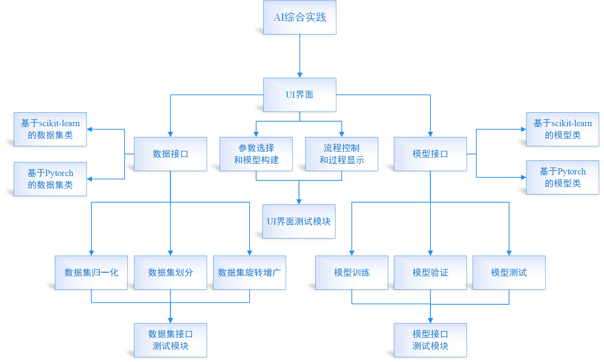

各功能体系结构说明如下：

- 数据集接口：实现数据集的导入，预处理（归一化和旋转增广），训练验证测试集划分功能
- 模型接口：实现模型的创建，训练，验证，测试，保存和导入功能
- UI界面：实现参数选择，流程控制和显示功能
- 接口测试：编写接口测试代码测试函数的准确性和界面合理性

## 2 数据集接口

### 2.1 数据集接口参数说明

本实验的数据集分为基于 `scikit-learn`的数据集和基于 `Pytorch`的数据集，其主要目的是适应于 `scikit-learn`和 `Pytorch`不同的数据载入模式。基于 `Pytorch`的数据集继承至 `torch.utils.data.Dataset`类，基于 `scikit-learn`的数据集为自设类。

两个数据集的初始化函数接口如下：

```Python
class CifarSklearnDataset:
    """
    基于Scikit-learn的Cifar数据集
    """

    def __init__(self, file_path: str, norm: bool, rotate: bool, train_val_test: str):
        """初始化函数
        :param file_path: 数据集文件路径
        :param norm: 是否进行归一化
        :param rotate: 是否进行数据旋转增广
        :param train_val_test: 训练集、验证集、测试集
        """


class CifarTorchDataset(Dataset):
    """
    基于PyTorch的CifarDataset数据集
    """

    def __init__(self, file_path: str, norm: bool, rotate: bool, train_val_test: str):
        """初始化函数
        :param file_path: 数据集文件路径
        :param norm: 是否进行归一化
        :param rotate: 是否进行数据旋转增广
        :param train_val_test: 训练集、验证集、测试集
        """
```

两者的函数接口相同，参数说明如下：

- `file_path`：CSV文件路径
- `norm`：是否进行归一化。如设置为 `True`，后续将进行数据集归一化
- `rotate`：是否进行旋转增广。如设置为 `True`，后续将进行数据集旋转增广处理。
- `train_val_test`，用于训练集、验证集和测试集的划分。

### 2.2 数据集预处理

#### 2.2.1 归一化

数据集归一化，指的是将数据集中不同比率范围的数据进行归一化处理，使其数值范围在 `[0, 1]` 或 `[-1, 1]` 之间。归一化的目的是为了加速模型的训练，提高模型的收敛速度。由于fer2013的数据集都是8位二进制图像，故在 `numpy`数组的前提下，归一化的代码为：

```python
# CifarSklearnDataset类
if (self.norm):
    self.datas = [np.array(list(map(int, i.split()))).reshape((48, 48))/255.0 for i in self.datas]

# CifarTorchDataset类
if (self.norm)
    # 归一化
    data = data/255.0
```

#### 2.2.2 旋转增广

数据集旋转增广，指的是对原有图像数据集通过旋转的方式进行扩充，以增加数据量，从而有效提升模型训练精度，提升模型的鲁棒性，同时避免过拟合的问题。本实验的数据集为$48*48$图像数据集，故旋转增广的方式为：将每一张图片分别旋转90°、180°、270°，同时保留原有标签，此时图像的数据量将变为原来的4倍。

由于CSV中读取的数据为具有2304个元素的一维数组，故要执行数据旋转增广操作，需先将其转变为$48*48$的图像，然后使用 `np.rot90`函数进行数据旋转增广操作。具体代码如下

```Python
# CifarSklearnDataset类
if (self.rotate):
    rotate_90 = [np.rot90(i, 1) for i in self.datas]
    rotate_180 = [np.rot90(i, 2) for i in self.datas]
    rotate_270 = [np.rot90(i, 3) for i in self.datas]
    self.datas = self.datas+rotate_90+rotate_180+rotate_270
    self.labels = [i for i in self.labels]*4

# CifarTorchDataset类
data = np.array(list(map(int, line[1].split()))).reshape((48, 48))
if (self.rotate):
     # 数据增广
     self.datas.append(data)
     self.datas.append(np.rot90(data, 1))
     self.datas.append(np.rot90(data, 2))
     self.datas.append(np.rot90(data, 3))
     self.labels.append(int(line[0]))
     self.labels.append(int(line[0]))
     self.labels.append(int(line[0]))
     self.labels.append(int(line[0]))
```

#### 2.2.3 训练集、验证集和测试集

在CSV文件中，Usage列将数据划分为三个集合。为了方便，我们可以此来进行训练集、验证集和测试集的划分。

模型初始化参数中的 `train_val_test`如设置为 `train`，则读取CSV中Usage为 `Training`的数据，模型生成训练集；如设置为 `val`，则读取CSV中Usage为 `PrivateTest`的数据，模型生成验证集；如设置为 `test`，则读取CSV中Usage为 `PublicTest`的数据，模型生成测试集。

```python
match(train_val_test):
    case 'train': # 训练集
    case 'val': # 验证集
    case 'test': # 测试集
```

### 2.3 数据集接口测试

在 `test_Dataset.py`中，设计了若干数据集接口测试内容。为了更好地检验测试结果，将图片转为$48*48$矩阵并将测试结果的前四个图像通过 `matplotlib`绘图。它们分别是：

- 测试 `CifarSklearnDataset`类，训练集，执行归一化，执行数据旋转增广。测试结果如下：

  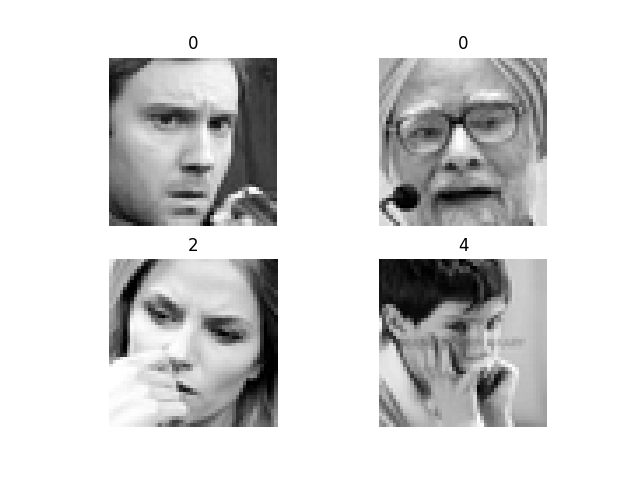
- 测试 `CifarSklearnDataset`类，验证集，不执行归一化，不执行数据旋转增广。测试结果如下：

  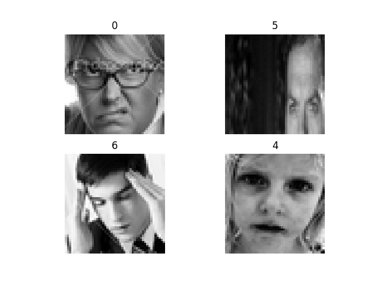
- 测试 `CifarSklearnDataset`类，测试集，执行归一化，执行数据旋转增广。测试结果如下：

  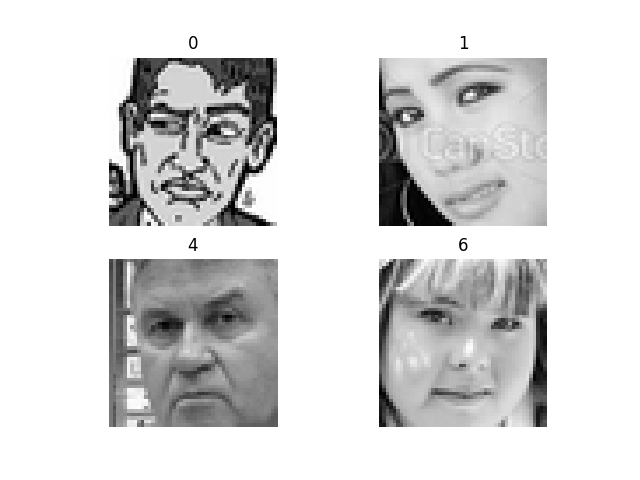
- 测试 `CifarTorchDataset`类，训练集，执行归一化，执行数据旋转增广。测试结果如下：

  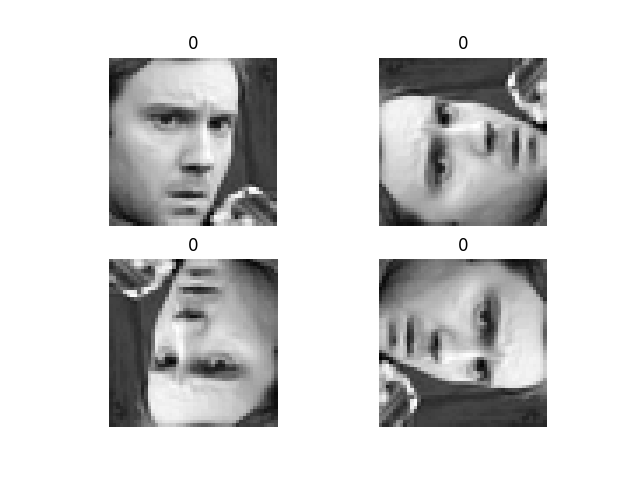
- 测试 `CifarTorchDataset`类，验证集，不执行归一化，不执行数据旋转增广。测试结果如下：

  
- 测试 `CifarTorchDataset`类，测试集，执行归一化，执行数据旋转增广。测试结果如下：

  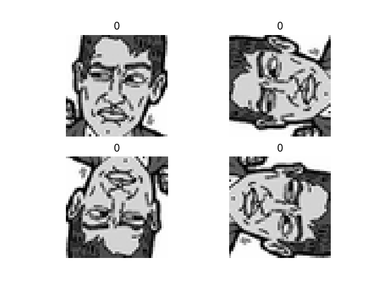

  注：在 `CifarSklearnDataset`类中，执行数据增广后由同一图像旋转之后得到的四幅图不位于相邻位置；在 `CifarTorchDataset`类中则位于相邻位置。具体可以看上面的代码。

## 3 模型接口

### 3.1 模型接口说明

为了在GUI中实现不同模型的统一处理，本实验采取了统一化的模型接口设计。本实验的模型分为 `MachineLearningModel`和 `DeepLearningModel`两种，前者使用 `scikit-learn`机器学习库进行模型的训练和预测，后者使用 `Pytorch`深度学习库进行模型的训练和预测。两者的模型类具有同名的方法。

```python
class MachineLearningModel:
    """
    机器学习模型类（MLP）
    """

    def __init__(self, num_classes, hidden_layer_sizes, activation, solver, alpha, batch_size, learning_rate, learning_rate_init, max_iter, early_stopping, train_dataset, val_dataset, test_dataset):
        # 模型初始化部分
    def Train(self):
        # 训练函数
    def Validate(self):
        # 验证函数
    def Test(self):
        # 测试函数
 
class DeepLearningModel:
    """
    深度学习模型类（Pytorch，AlexNet）
    """
    def __init__(self, num_classes, net, batch_size: int, epoch: int, shuffle: bool, Validate_frequency: int, lr: float, lr_decent: bool, device: torch.device, criterion, optimizer: str, OutputDir: str, train_dataset: Dataset, val_dataset: Dataset, test_dataset: Dataset):
    	# 模型初始化部分
    def Train(self):
        # 训练函数
    def Validate(self):
        # 验证函数
    def Test(self):
        # 测试函数
```

可以看到，无论是 `MachineLearningModel`还是 `DeepLearningModel`，它们的核心功能部分的接口是相同的。这样，后续的 `model`变量调用就无需分类讨论，只需要直接调用接口就行：

```python
model.Train()
model.Validate()
model.Test()
```

对于不同的模型，三个接口的核心代码和功能如下：

- 在 `MachineLearningModel`中，`Train()`函数的主体为 `MLPClassifier.fit(X,y)`，其中X，y为训练集的数据和标签；而在 `DeepLearningModel`中，`Train()`函数的主体为深度学习模型的训练，通过梯度下降、参数优化、学习率调优等方式训练模型，且会在训练过程中输出训练集 `Loss`，训练集 `Accuracy`和验证集 `Accuracy`，训练结束后还会将上述结果以折线图形式展示
- 在 `MachineLearningModel`中，`Validate()`函数的主体为 `MLPClassifier.score(X,y)`，其中X，y为验证集的数据和标签，用于返回模型分数；而在 `DeepLearningModel`中，`Validate()`函数的主体为使用验证集进行验证，并返回验证集精度
- 在 `MachineLearningModel`和 `DeepLearningModel`中，`Test()`函数都将对已有的模型进行测试，计算$TP$、$FN$、$TN$、$FP$，并得到准确率、精确率、召回率和$F1$值，最后绘制$ROC$曲线，返回上述值构成的字典

### 3.2 机器学习模型类的模型参数说明

在 `sklearn.MLPClassifier`模型中存在多个参数。本实验通过模型类的初始化函数接口方式，将这些参数全部设为可调，以便于在GUI上设置。具体初始化函数如下：

```python
class MachineLearningModel:
    """
    机器学习模型类（MLP）
    """

    def __init__(self, num_classes, hidden_layer_sizes, activation, solver, alpha, batch_size, learning_rate, learning_rate_init, max_iter, early_stopping, train_dataset, val_dataset, test_dataset):
        """初始化函数
        :param num_classes: 输出类别数
        :param hidden_layer_sizes: 隐藏层大小
        :param activation: 激活函数
        :param solver: 优化器
        :param alpha: 正则化参数
        :param batch_size: 批大小
        :param learning_rate: 学习率
        :param learning_rate_init: 初始学习率
        :param max_iter: 最大迭代次数
        :param early_stopping: 是否使用EarlyStop
        :param train_dataset: 训练集
        :param val_dataset: 验证集
        :param test_dataset: 测试集
        """
        self.num_classes = num_classes
        self.hidden_layer_sizes = hidden_layer_sizes
        self.activation = activation
        self.solver = solver
        self.alpha = alpha
        self.batch_size = batch_size
        self.learning_rate = learning_rate
        self.learning_rate_init = learning_rate_init
        self.max_iter = max_iter
        self.early_stopping = early_stopping
        self.train_dataset = train_dataset
        self.val_dataset = val_dataset
        self.test_dataset = test_dataset
        # 构建模型
        self.mlp = MLPClassifier(hidden_layer_sizes=self.hidden_layer_sizes, activation=self.activation, solver=self.solver, alpha=self.alpha, batch_size=self.batch_size, learning_rate=self.learning_rate, learning_rate_init=self.learning_rate_init, max_iter=self.max_iter, early_stopping=self.early_stopping)
```

初始化参数包括：

- `num_classes`：输出类别数
- `hidden_layer_sizes`：隐藏层大小
- `activation`：激活函数
- `solver`：优化器
- `alpha`：正则化参数
- `batch_size`：批大小
- `learning_rate`：学习率
- `learning_rate_init`：初始学习率
- `max_iter`：最大迭代次数
- `early_stopping`：是否使用EarlyStop
- `train_dataset`：训练集
- `val_dataset`：验证集
- `test_dataset`：测试集

这些参数将在GUI中提供默认值，并允许自由修改。设置完成后，模型类将自动生成机器学习模型 `MLPClassifier`。

### 3.3 深度学习模型类的模型参数说明

#### 3.3.1 深度学习超参数

无论是 `MLP`还是 `AlexNet`，只要是基于 `Pytorch`的深度学习模型，它们的超参数部分是接近的。因此深度学习模型类可以使用同样的初始化函数，其具体形式如下：

```python
class DeepLearningModel:
    """
    深度学习模型类
    """

    def __init__(self, num_classes, net, batch_size: int, epoch: int, shuffle: bool, Validate_frequency: int, lr: float, lr_decent: bool, device: torch.device, criterion, optimizer: str, OutputDir: str, train_dataset: Dataset, val_dataset: Dataset, test_dataset: Dataset):
        """初始化函数
        :param num_classes: 输出类别数
        :param net: 网络模型
        :param batch_size: 批大小
        :param epoch: 训练轮数
        :param shuffle: 是否打乱数据
        :param Validate_frequency: 验证频率，每多少个epoch验证一次，设置为0则不验证
        :param lr: 学习率
        :param lr_decent: 是否使用学习率下降
        :param device: 训练设备
        :param criterion: 损失函数
        :param optimizer: 优化器
        :param OutputDir: 模型输出路径
        :param train_dataset: 训练集
        :param val_dataset: 验证集
        :param test_dataset: 测试集
        """
        torch.cuda.empty_cache()
        self.num_classes = num_classes
        self.net = net
        self.batch_size = batch_size
        self.epoch = epoch
        self.shuffle = shuffle
        self.Validate_frequency = Validate_frequency
        self.lr = lr
        self.lr_decent = lr_decent
        self.device = device
        self.criterion = criterion
        self.optimizer = optimizer
        self.OutputDir = OutputDir
        self.Pause = False  # 是否暂停
        self.Restart = False  # 是否重新训练
        # 加载到设备
        self.net = self.net.to(self.device)
        self.criterion = self.criterion.to(self.device)
        # 准备数据集
        self.train_dataset = train_dataset
        self.val_dataset = val_dataset
        self.test_dataset = test_dataset
        # 归一化必须要一样
        assert self.train_dataset.norm == self.val_dataset.norm == self.test_dataset.norm
        # 加载数据集
        self.train_dataloader = DataLoader(
            self.train_dataset, batch_size=self.batch_size, shuffle=self.shuffle)
        self.val_dataloader = DataLoader(
            self.val_dataset, batch_size=self.batch_size, shuffle=self.shuffle)
        self.test_dataloader = DataLoader(
            self.test_dataset, batch_size=self.batch_size, shuffle=self.shuffle)
```

初始化参数包括：

- `num_classes`：输出类别数
- `net`：网络模型
- `batch_size`：批大小
- `epoch`：训练轮数
- `shuffle`：是否打乱数据
- `Validate_frequency`：验证频率，每多少个epoch验证一次，设置为0则不验证
- `lr`：学习率
- `lr_decent`：是否使用学习率下降
- `device`：训练设备
- `criterion`：损失函数
- `optimizer`：优化器
- `OutputDir`：模型输出路径
- `train_dataset`：训练集
- `val_dataset`：验证集
- `test_dataset`：测试集

这些参数将在GUI中提供默认值，并允许自由修改。设置完成后，模型类将自动生成深度学习模型，并可根据设置的超参数执行训练、验证、预测等环节。

#### 3.3.2 深度学习网络

在 `DeepLearningModel`的 `net`属性中，实验提供了两种神经网络可以选择，它们均位于 `Net.py`中，分别是三层的 `MLP`网络和5个卷积层和3个全连接层的 `AlexNet`网络。

```python
class AlexNet(nn.Module):
    """
    AlexNet模型
    """

    def __init__(self, num_classes: int, linear_num: int, p: float, activation):
        """初始化函数
        :param num_classes：输出类别数
        :param linear_num：全连接层神经元数
        :param p：Dropout概率
        :param activation：激活函数
        """
        super(AlexNet, self).__init__()
        self.net = nn.Sequential(
            nn.Conv2d(1, 96, kernel_size=5, padding=1), activation,
            nn.MaxPool2d(kernel_size=3, stride=2),
            nn.Conv2d(96, 256, kernel_size=5, padding=1), activation,
            nn.MaxPool2d(kernel_size=3, stride=2),
            nn.Conv2d(256, 384, kernel_size=3, padding=1), activation,
            nn.Conv2d(384, 384, kernel_size=3, padding=1), activation,
            nn.Conv2d(384, 256, kernel_size=3, padding=1), activation,
            nn.MaxPool2d(kernel_size=3, stride=2),
            nn.Flatten(),
            nn.Linear(4096, linear_num), activation,
            nn.Dropout(p),
            nn.Linear(linear_num, linear_num), activation,
            nn.Dropout(p),
            nn.Linear(linear_num, num_classes)
        )

    def forward(self, x):
        x = x.unsqueeze(-1)
        x = x.permute(0, 3, 1, 2)
        x = self.net(x)
        return x


class MLP(nn.Module):
    """
    MLP模型
    """

    def __init__(self, num_classes: int, linear_num: list, activation):
        """初始化函数
        :param num_classes：输出类别数
        :param linear_num：每层MLP的神经元数量，以数组形式呈现
        :param activation：激活函数
        """
        super(MLP, self).__init__()
        assert len(linear_num) == 4
        self.net = nn.Sequential(
            nn.Flatten(),
            nn.Linear(48 * 48, linear_num[0]),
            activation,
            nn.Linear(linear_num[0], linear_num[1]),
            activation,
            nn.Linear(linear_num[1], linear_num[2]),
            activation,
            nn.Linear(linear_num[2], linear_num[3]),
            activation,
            nn.Linear(linear_num[3], num_classes)
        )

    def forward(self, x):
        x = self.net(x)
        return x
```

在这两个网络中，`MLP`和 `AlexNet`的全连接层大小和激活函数可以自由调整，就如同 `MachineLearningModel`中的 `hidden_layer_sizes`和 `activation`属性一样。另外，`AlexNet`的 `Dropout`概率也可以进行调整。这些可自由选择的部分都将在GUI中设置默认值，并允许自由调整。这两个网络都可以接受深度学习数据集数据的输入，交换维度等过程在 `forward`函数中实现。

### 3.4 模型接口测试

在 `test_ModelNet.py`中，设计了若干模型接口测试内容。它们分别是：

- 测试基于机器学习的 `MLP`网络的模型训练。隐藏层大小：`(128,128)`，激活函数：`ReLU`，优化器：`Adam`，学习率：`constant`，批大小：`auto`，训练轮数：`100`，是否打乱数据：`True`，是否使用Earlystop：`False`，训练集：`fer2013_data/fer2013.csv`，执行归一化，不执行数据旋转增广，验证集：`fer2013_data/fer2013.csv`，执行归一化，不执行数据旋转增广，测试集：`fer2013_data/fer2013.csv`，执行归一化，不执行数据旋转增广。测试结果如下：

  ```
  0.41125661744218445
  {'Accuracy': [0.13444108761329304, 0.1, 0.1484593837535014, 0.41520100502512564, 0.17995910020449898, 0.37481698389458273, 0.22567287784679088], 'Precision': [0.31338028169014087, 0.3333333333333333, 0.3271604938271605, 0.48674521354933725, 0.35129740518962077, 0.48854961832061067, 0.3778162911611785], 'Recall': [0.1905781584582441, 0.125, 0.21370967741935484, 0.7385474860335196, 0.26952526799387444, 0.6168674698795181, 0.35914332784184516], 'F1': [0.23701731025299602, 0.18181818181818182, 0.25853658536585367, 0.5867731913004882, 0.30502599653379553, 0.5452609158679447, 0.36824324324324326]}
  ```

  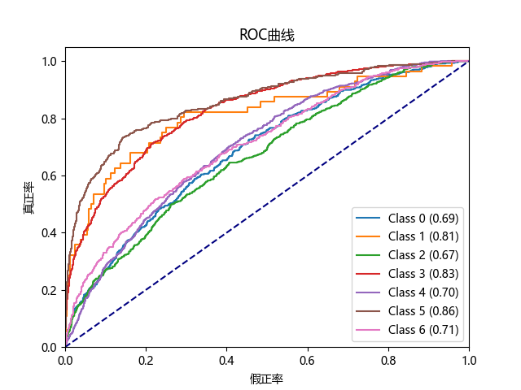
- 测试 `MLP`网络的模型训练。网络模型：`MLP`，输出类别数：`7`，`MLP`总层数：`3`，每层 `MLP`的神经元数量：`[512, 128, 512, 128]`，激活函数：`ReLU`，批大小：`64`，训练轮数：`10`，是否打乱数据：`True`，验证频率：`2`，学习率：`0.001`，训练设备：`CUDA`，损失函数：`CrossEntropyLoss`，优化器：`Adam`，模型输出路径：`model/`，训练集：`fer2013_data/fer2013.csv`，执行归一化，不执行数据旋转增广，验证集：`fer2013_data/fer2013.csv`，执行归一化，不执行数据旋转增广，测试集：`fer2013_data/fer2013.csv`，执行归一化，不执行数据旋转增广。测试结果如下：

  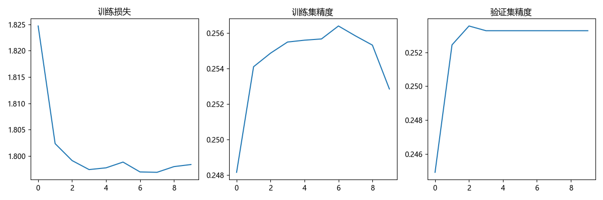

  ```
  0.25327389244915016
  {'Accuracy': 0.2596823627751463, 'Precision': [0.0, 0.0, 0.0, 0.9087982832618026, 0.09120171673819742, 0.0, 0.0], 'Recall': [0.0, 0.0, 0.0, 0.9463687150837988, 0.13016845329249618, 0.0, 0.0], 'F1': [0, 0, 0, 0.9272030651340997, 0.10725552050473186, 0, 0]}
  ```

  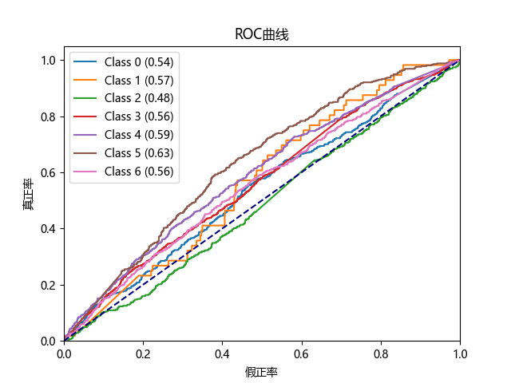
- 测试 `AlexNet`网络的模型训练。网络模型：`AlexNet`，输出类别数：`7`，全连接层神经元数：`512`，`Dropout`概率：`0.5`，激活函数：`ReLU`，批大小：`64`，训练轮数：`10`，是否打乱数据：`True`，验证频率：`1`，学习率：`0.001`，训练设备：`CUDA`，损失函数：`CrossEntropyLoss`，优化器：`Adam`，模型输出路径：`model/`，训练集：`fer2013_data/fer2013.csv`，执行归一化，不执行数据旋转增广，验证集：`fer2013_data/fer2013.csv`，执行归一化，不执行数据旋转增广，测试集：`fer2013_data/fer2013.csv`，执行归一化，不执行数据旋转增广。测试结果如下：

  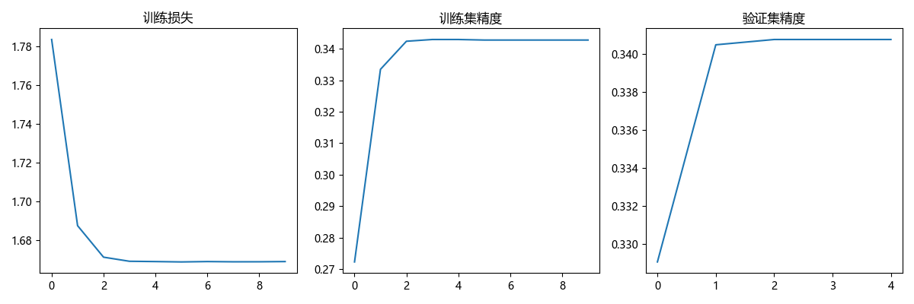

  ```
  0.34076344385622737
  {'Accuracy': 0.34772917247144053, 'Precision': [0.0, 0.0, 0.029647435897435896, 0.5464743589743589, 0.07532051282051282, 0.17467948717948717, 0.17387820512820512], 'Recall': [0.0, 0.0, 0.07459677419354839, 0.7620111731843575, 0.1439509954058193, 0.5253012048192771, 0.357495881383855], 'F1': [0, 0, 0.04243119266055046, 0.6364909006066263, 0.09889531825355076, 0.26217678893565843, 0.23396226415094334]}
  ```

  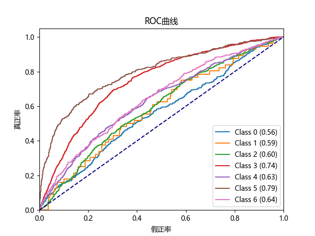

## 4 UI设计

### 4.1 模型选择UI界面设计和功能

#### 4.1.1 模型选择UI界面简介

模型选择UI界面由 `tkinter`库设计，将前面提到的模型类所有可选参数用 `grid()`方法呈网格状布置于GUI窗口上。可以通过GUI窗口选择想要的模型并选择合适的参数。

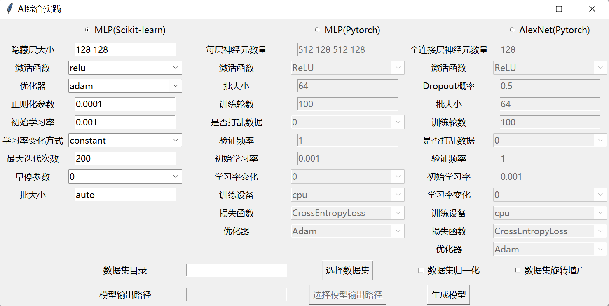

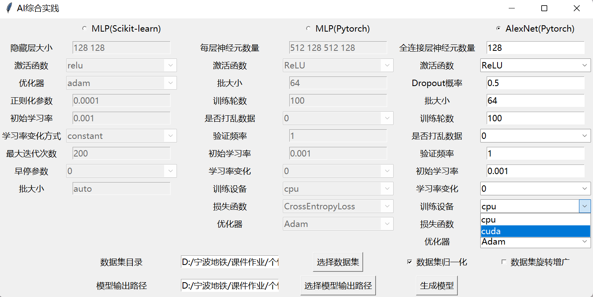

#### 4.1.2 模型选择UI界面功能

在UI界面的最顶上，有三种模型可选，分别是基于 `scikit-learn`的 `MLP`，基于 `Pytorch`的 `MLP`和基于 `Pytorch`的 `AlexNet`。当选择其中一种模型时，其下方的参数选择按钮变得可用。部分参数通过下拉框从已知值中选择一项；剩余参数可直接输入数字或字符串值。特别注意，两个 `MLP`模型的隐藏层大小和每层神经元数量为数组格式，前者为空格隔开的任意长度数组，后者为空格隔开的长度为4的数组。

由于 `scikit-learn`不需要输出模型，故模型输出路径功能仅仅在选择 `Pytorch`模型时可用，用于指定模型输出的文件夹。数据集目录指向CSV文件；右侧的勾选按钮可以选择是否进行数据集归一化和数据集旋转增广。

全部输入完成后点击“生成模型”，大约需要30s-1min左右时间（取决于是否执行归一化和旋转增广），如模型生成成功，将会跳出“模型生成成功”提示框并跳出模型训练窗口；否则将会跳出“模型输入参数有误”提示框。这里实际上就是执行了模型类的构造函数接口。

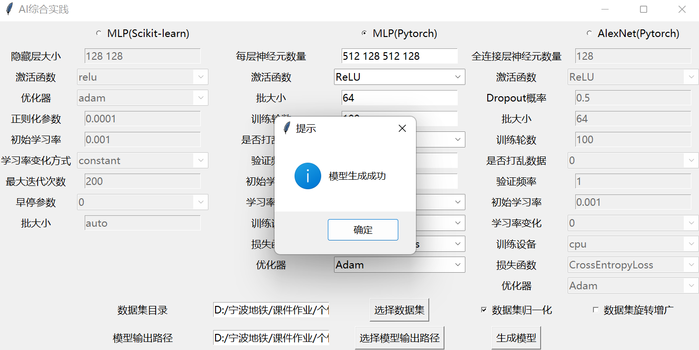

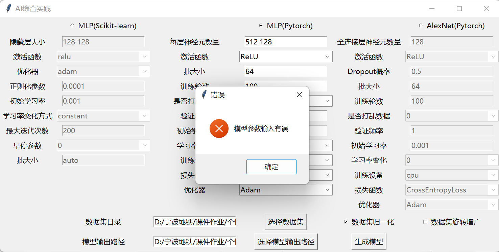

### 4.2 模型训练UI界面设计和功能

#### 4.2.1 模型训练UI界面简介

模型训练UI界面由 `tkinter`库设计，将模型训练和测试日志框、模型操作按钮用 `pack()`方法按顺序布置于GUI窗口上。可以通过GUI窗口对模型训练进行控制。

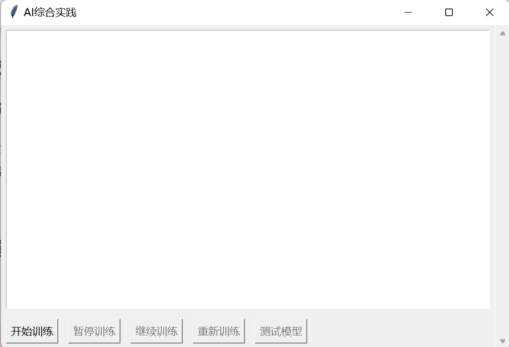

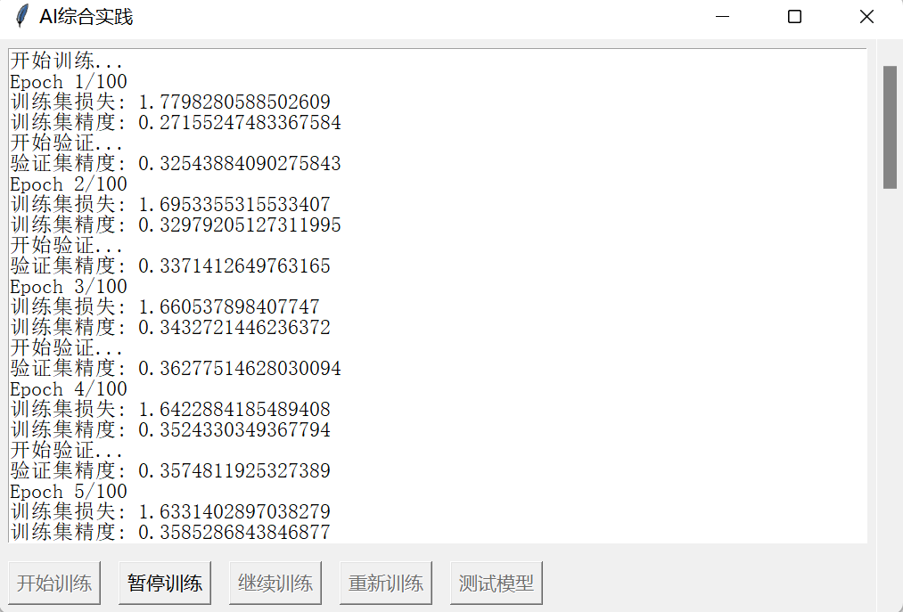

#### 4.2.2 模型训练UI界面功能

##### 4.2.2.1 通过日志更新文本框实现训练过程输出

由于模型训练时间很长，而训练过程中需要不断在GUI界面输出日志信息，使用 `tkinter`单纯的回调函数无法完成任务，必须等到训练完成后才会更新文本框。故模型训练UI界面使用了多线程来实现这一功能。

具体来说，就是在模型类中增加了一个队列变量，用于存储日志信息。`GUI`窗口每隔一定时间（很短时间）访问 `model`类中的日志队列，输出日志并出队。

```python
import queue
class Model: # MachineLearningModel,DeepLearningModel都一样，这里省略
    def __init__(self):
        # 省略
        self.log = queue.Queue()
    def print_log(self):
        # 模拟日志输出
        self.log.put('训练日志')


# 在模型训练UI中
class ModelTrainUI(tk.Frame):
    """
    模型训练界面
    """
    def __init__(self, master, model):
        # 省略
    def StartTraining(self):
        """开始训练"""
        # 多线程启动训练
        self.Training_thread = threading.Thread(target=self.model.Train)
        self.Training_thread.start()
    def UpdateLog(self):
        """更新文本框"""
        while not self.model.log.empty():
            # 获取model中的一条日志
            log_message = self.model.log.get()
            self.text.insert(tk.END, log_message + '\n')
            self.text.yview(tk.END)  # 自动滚动到最底部
        # 每10ms更新一次日志
        self.after(10, self.UpdateLog)
```

模型的训练、验证、测试都需要花较长时间，因此将原有的 `print()`函数转为多线程日志模式是一种很好的方法。

##### 4.2.2.2 机器学习模型类训练过程

由于 `MLPClassifier`的 `fit`函数已经在内部完成了封装，无法强行停止线程，故机器学习模型仅支持开始训练、重新训练和测试模型三个功能。

初始状态下仅“开始训练”按钮可用。点击“开始训练”按钮进行训练，一段时间后，文本框内会输出权重、偏置等训练信息和模型得分等验证信息。


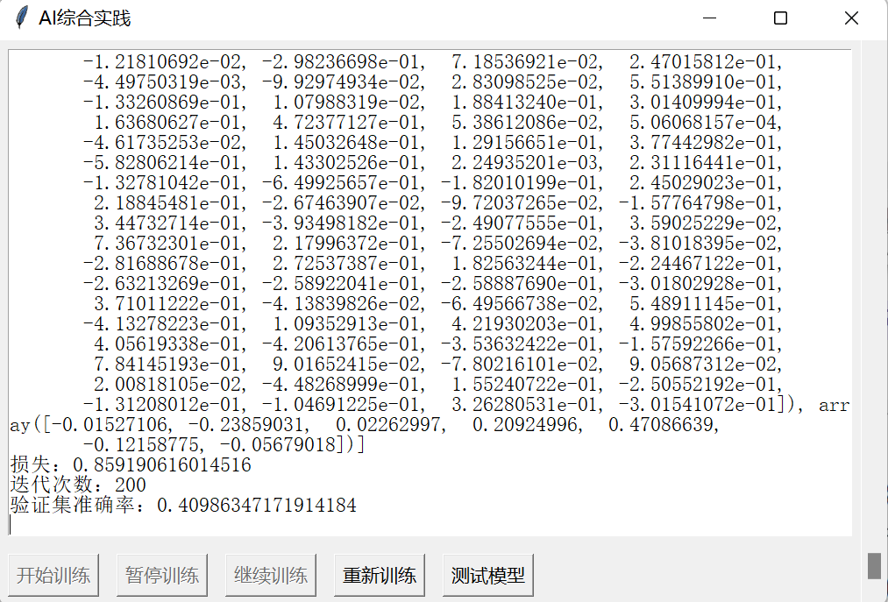

然后可以点击“测试模型”按钮进行模型测试，就像前面测试接口提到的那样，输出准确率、精确率、召回率和$ROC$曲线等指标。

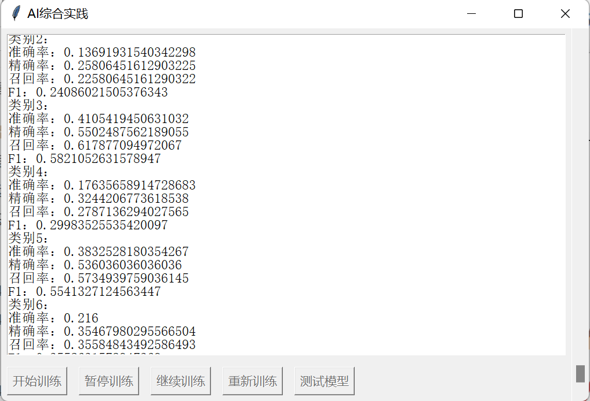

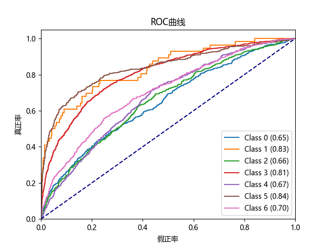

也可以点击“重新训练”按钮，清空文本框，回到“开始训练”状态，重新训练模型。


##### 4.2.2.3 深度学习模型类训练过程

在深度学习类的 `Train()`接口中，进行了一定的修改，使其能够支持暂停训练、继续训练、重新训练等功能：

```python
class DeepLearningModel:
    """
    深度学习模型类
    """
    def __init__(self):
        # 省略
    def Train(self):
        self.log.put('开始训练...')
        torch.save(self.net.state_dict(), self.OutputDir+'/model_0.pth')
        train_losses = []
        train_accuracies = []
        val_accuracies = []
        # 训练
        for epoch in range(self.epoch):
            # 暂停
            while (self.Pause):
                if (self.Restart):
              	    self.net.load_state_dict(torch.load(self.OutputDir+'/model_0.pth'))
                    return (0, 0), 0
                else:
                    time.sleep(0.1)
            # 后续训练过程
```

- 在训练开始前，先将模型的初始状态保存为 `model_0.pth`
- 设置一个 `Pause`属性和 `Restart`属性。由于可以通过 `self.model`从外部访问线程，故当点击“暂停训练”按钮，`Pause`属性设置为 `True`时，模型将会在训练完当前epoch后暂停。这时如点击“重新训练”按钮，则 `Restart`属性设置为 `True`，先将模型转变为初始状态 `model_0.pth`，然后强制终止 `Train()`函数。如点击“继续训练”按钮，则 `Pause`属性设置为 `False`，模型训练继续

深度学习模型训练界面的初始状态下，“开始训练”和“测试模型”按钮均可用。可以开始训练模型，也可以对训练好的模型进行直接测试。这里先演示“开始训练”按钮，测试将在后面提及。

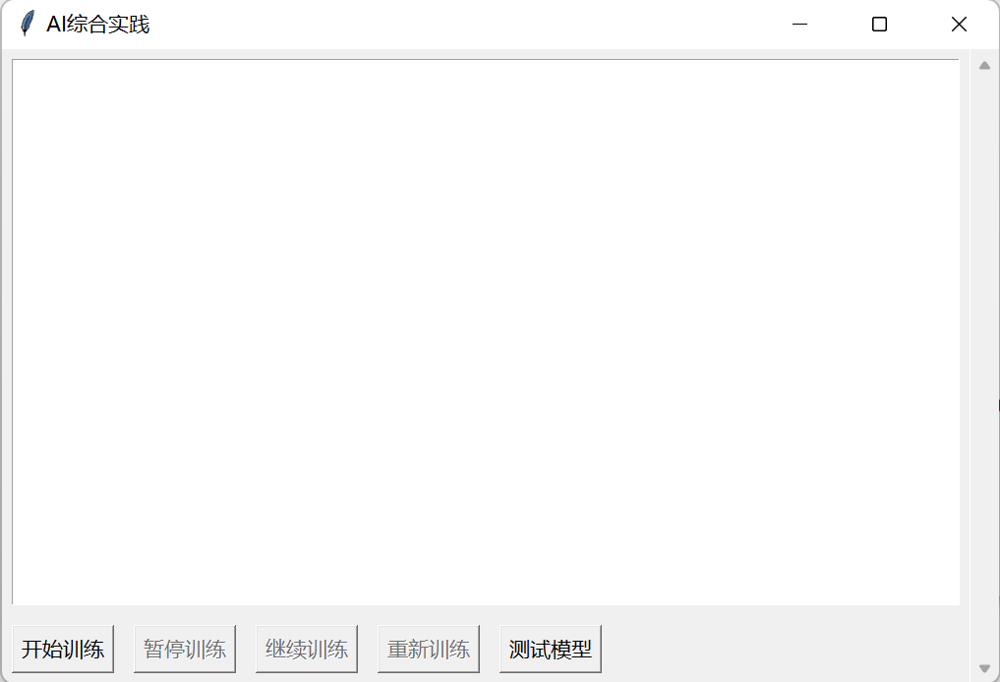

点击“开始训练”按钮，文本框中将会不断输出训练损失、训练精度。如果到了需要验证的epoch（总epoch/验证频率），则还会输出验证精度。

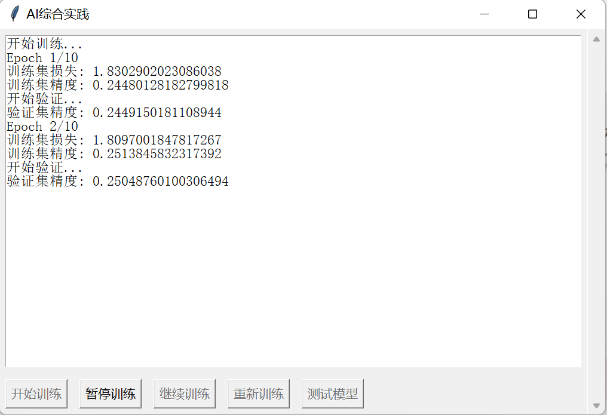

点击“暂停训练”按钮，模型将会在训练完当前epoch之后暂停。

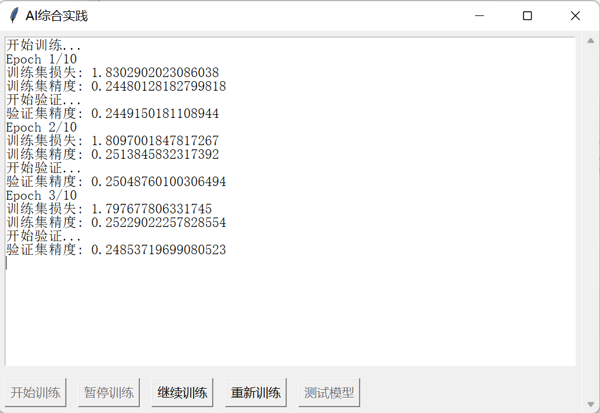

点击“继续训练”按钮可继续训练。

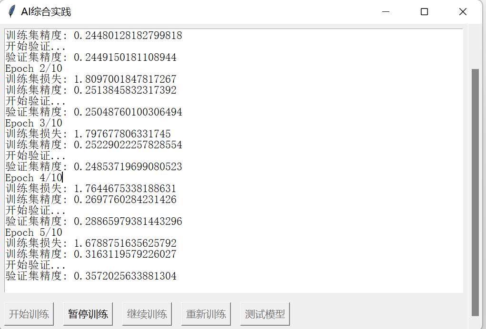

训练得到的模型会以 `model_i.pth`的格式自动保存在模型选择UI界面选择的文件夹中。其中第0个模型为初始模型，剩余的为训练得到的模型。

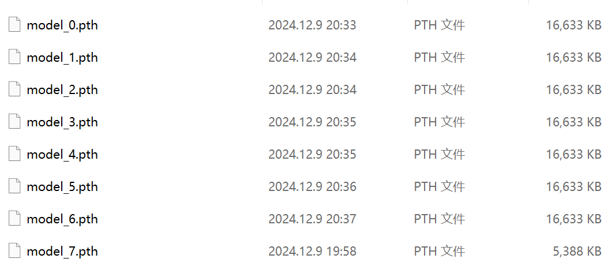

点击“重新训练”按钮，将清空模型文件夹中的所有模型，同时回到模型训练开始前的状态。另外，测试模型按钮也不再可用（因为没有模型可供测试）。


无论是在训练之前，还是训练之后，点击“测试模型”按钮，均会跳出来一个整数输入框，询问测试第几个模型。

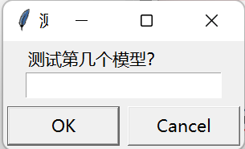

在输入框中输入整数（注意不是模型全名），程序会自动从模型文件夹中搜索对应的模型进行测试。如果找不到模型，则会弹出错误提示“模型文件不存在或不匹配”（属于不存在的错误）。另外，已有的模型可能会与模型选择界面点击“生成模型”的按钮生成的模型框架结构不同（例如隐藏层数量不同）。出现这种情况，则也会弹出错误提示“模型文件不存在或不匹配”（属于不匹配的错误）。

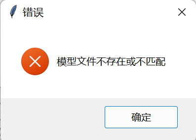

但是，模型训练和预测过程中是否归一化如果不统一，程序暂时无法识别。这时候模型的测试精确度会比较低，要避免这种情况。

如果都没问题，就可以正常开始测试。和前面的机器学习模型类一样，测试会输出准确率、精确率、召回率和ROC曲线等指标。

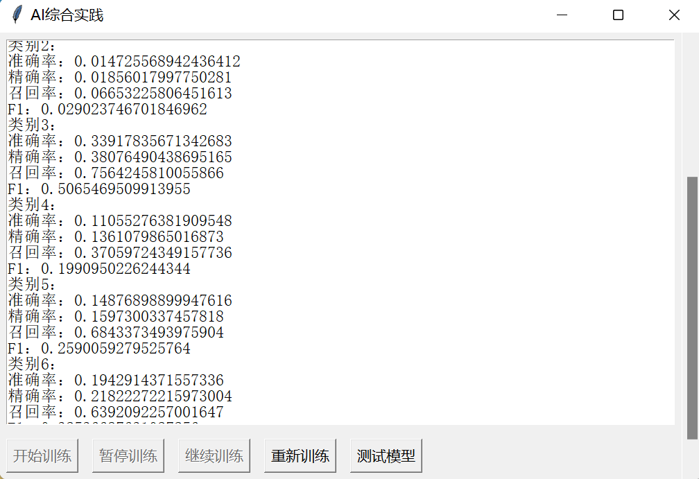

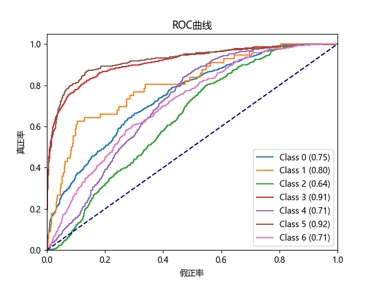

测试接口也使用了多线程的模式，防止窗口卡顿。

```python
class DeepLearningModel:
    """
    深度学习模型类
    """
    # 前面省略
    def TestModel(self):
        """测试模型"""
        if (isinstance(self.model, DeepLearningModel)):
            modelnum = askinteger('测试模型', '测试第几个模型？')
            try:
                self.model.net.load_state_dict(torch.load(self.model.OutputDir+'/model_%d.pth' % modelnum))
            except:
                showerror('错误', '模型文件不存在或不匹配')
                return
            self.Test_thread = threading.Thread(
                    target=self.model.Test, args=(modelnum,))
            self.Test_thread.start()
        elif (isinstance(self.model, MachineLearningModel)):
            self.Test_thread = threading.Thread(target=self.model.Test)
            self.Test_thread.start()
```

当“模型训练”窗口被关闭时，如训练还在进行，系统会自动销毁所有训练、测试线程，并销毁模型

```python
class ModelChooseUI(tk.Frame):
    """
    模型选择界面
    """
	# 前面略去
    def on_close(self):
        """关闭窗口的函数
        """
        if(isinstance(self.model, DeepLearningModel)):
            self.model.Restart = True
            self.model.Pause = True
        self.TrainFrame.destroy()
        self.model = None
```

## 5 运行方式

### 5.1 通过脚本运行

由于脚本中含有 `match...case`语句，所以通过脚本运行需要Python 3.10及以上版本

安装必要的库后，运行主函数文件 `Main.py`即可。注意GPU版 `Pytorch`的安装：

```bash
pip3 install torch --index-url https://download.pytorch.org/whl/cu118
```

`tkinter`为标准库，无需安装。

### 5.2 通过可执行文件运行

本实验可以生成可执行文件 `main.exe`，具体生成方式为：

```bash
path/to/pyinstaller -F -w Main.py
```

生成的可执行文件在 `dist`文件夹中，双击其即可运行。由于文件过大，这里暂时无法提交。

## 6 实验总结

本次实验是基于GUI和 `Pytorch`、`scikit-learn`的一次很好的综合开发实践，它有效地让我学到了在日常作业中学不到的东西——函数和类接口的设计和调用，代码的编码规范等。另外，我之前自学的 `tkinter`知识也为这次作业起到了很大的帮助。本次实验共实现了3种不同的机器学习或深度学习模型，每种模型可调节大量参数，真正实现了机器学习和深度学习的全方位探索。
